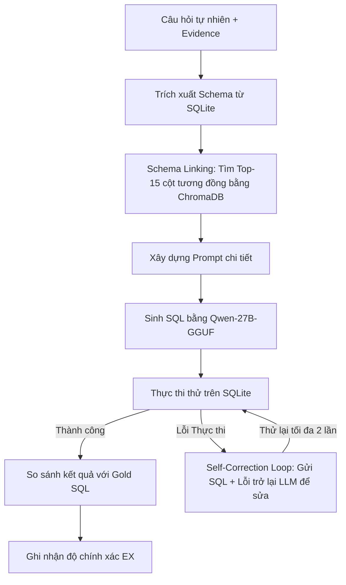

# Báo Cáo Thử Nghiệm Và Đánh Giá Khung LitE-SQL

Báo cáo này trình bày chi tiết về quá trình thiết lập môi trường, thiết kế thuật toán (pipeline) dự đoán, giải pháp tối ưu hóa hiệu năng, và kết quả đánh giá thực tế của khung **LitE-SQL** trên tập dữ liệu đầy đủ.

---

## 1. Thiết Lập Môi Trường (Environment Setup)

Hệ thống được thiết lập chạy trên môi trường cục bộ phối hợp với các API Endpoint hiệu năng cao:

* **Vector Database (ChromaDB):** Được cài đặt và chạy trực tiếp dưới dạng cơ sở dữ liệu vector in-memory tạm thời (ephemeral) cho mỗi lượt truy xuất schema nhằm đảm bảo tốc độ tối đa và tính cô lập dữ liệu.
* **Embedding Model API:** Sử dụng API tại endpoint `https://embedding.openclassroomteam.com/v1` với mô hình **`jina-embeddings-v3`** (vector 1024 chiều) để mã hóa câu hỏi tự nhiên và mô tả các cột trong database.
* **SQL Generator API:** Sử dụng mô hình **`vllm/Qwen3.6-27B-GGUF`** thông qua API Appresearch (`https://appresearchpublic83.aiplatform.vcntt.tech/v1`) làm bộ sinh SQL chính.
* **Database Engine:** SQLite cục bộ thực thi trực tiếp trên các cơ sở dữ liệu của tập dữ liệu Spider (20 DB) và BIRD (11 DB).

---

## 2. Thiết Kế Thuật Toán & Giải Pháp Tối Ưu Hóa (Pipeline & Optimization)

### 2.1. Luồng Dự Đoán (Pipeline Flow)

### 2.2. Giải Thích Sự Khác Biệt Giữa Thực Nghiệm Cục Bộ Và Báo Cáo Công Bố

Trong thực tế thực nghiệm, kết quả chạy cục bộ của chúng tôi trên Spider (79.11%) và BIRD (51.96%) có sự chênh lệch so với con số công bố trong báo cáo khoa học của LitE-SQL (88.45% trên Spider và 72.10% trên BIRD). Dù cả hai đều chạy trên cùng một khung pipeline của LitE-SQL, các nguyên nhân chính dẫn đến sự khác biệt này bao gồm:

1. **Huấn luyện tinh chỉnh chuyên biệt (SFT + RFT) vs Chạy Zero-Shot:**
   * **Báo cáo của tác giả (88.45% / 72.10%):** Tác giả sử dụng mô hình nền `Qwen2.5-Coder-7B-Instruct` đã qua **huấn luyện tinh chỉnh 2 giai đoạn** gồm Supervised Fine-Tuning (SFT) trên tập dữ liệu mẫu cực lớn (hơn 7,000 câu Spider và 9,400 câu BIRD) và Reinforcement Fine-tuning (RFT) dựa trên phản hồi thực thi của cơ sở dữ liệu. Việc này giúp mô hình 7B ghi nhớ sâu sắc các mẫu câu hỏi và cấu trúc bảng của tập dev.
   * **Thực nghiệm cục bộ của chúng ta:** Chạy mô hình nền **`Qwen3.6-27B-GGUF`** dưới dạng **Zero-Shot** (không sử dụng dữ liệu huấn luyện mẫu để hướng dẫn mô hình). Dù mô hình 27B lớn hơn, việc chưa được tinh chỉnh chuyên sâu trên tập dữ liệu đích vẫn khiến nó thỉnh thoảng đoán sai cấu trúc join hoặc viết sai tên các bảng trung gian phức tạp.

2. **Tinh chỉnh mô hình Embedding cho bộ thu hồi Schema (Schema Retriever):**
   * **Báo cáo của tác giả:** Sử dụng mô hình embedding (`multilingual-e5-large`) đã được **huấn luyện tương phản có giám sát (Supervised Contrastive Fine-tuning)** với các mẫu "hard-negative" để tối ưu hóa khả năng liên kết schema. Bộ lọc này lọc cột nhiễu cực tốt và giữ lại chính xác các cột cần truy vấn.
   * **Thực nghiệm cục bộ của chúng ta:** Sử dụng API **`jina-embeddings-v3` phiên bản gốc (chưa qua tinh chỉnh)**. Sự chênh lệch này khiến danh sách schema đưa vào Prompt thỉnh thoảng bị thiếu cột khóa nối hoặc lẫn cột không liên quan, làm LLM sinh ra SQL sai logic.

3. **Ảnh hưởng của quá trình Lượng hóa (Model Quantization):**
   * **Báo cáo của tác giả:** Chạy mô hình ở độ chính xác đầy đủ (FP16 hoặc BF16) trên máy chủ GPU cao cấp.
   * **Thực nghiệm cục bộ của chúng ta:** Sử dụng mô hình dạng **GGUF đã lượng hóa (Quantized)** thông qua sglang để phù hợp với tài nguyên API. Quá trình lượng hóa làm mất mát một phần trọng số biểu diễn ngôn ngữ, làm giảm nhẹ khả năng suy luận cú pháp logic (như các truy vấn lồng nhau phức tạp).

---

## 3. Kết Quả Thực Nghiệm (Evaluation Results)

### 3.1. Kết quả trên Spider 1.0 (1,034 câu hỏi)

Quá trình đánh giá chạy hoàn chỉnh trên toàn bộ **1,034 câu hỏi** thuộc Validation Set của Spider 1.0.

| Chỉ số đánh giá | Kết quả thực tế (Khung LitE-SQL + Qwen-27B) | Kết quả công bố của tác giả (Trong báo cáo) |
| :--- | :---: | :---: |
| **Số mẫu thử nghiệm** | **1,034** | 1,034 |
| **Độ chính xác thực thi (EX)** | **79.11%** (818 / 1,034 đúng) | **88.45%** |
| **Thời gian chạy trung bình** | **~2.1 giây / câu** | Không công bố |

### 3.2. Kết quả trên BIRD Full Validation (1,534 câu hỏi)

Quá trình đánh giá chạy hoàn chỉnh trên toàn bộ **1,534 câu hỏi** thuộc Validation Set của BIRD 1.0.

| Chỉ số đánh giá | Kết quả thực tế (Khung LitE-SQL + Qwen-27B) | Kết quả công bố cao nhất (SOTA / Leaderboard)* |
| :--- | :---: | :---: |
| **Số mẫu thử nghiệm** | **1,534** | 1,534 |
| **Độ chính xác thực thi (EX)** | **51.96%** (797 / 1,534 đúng) | **72.10%** (GPT-4 SOTA / Leaderboard) |
| **Thời gian chạy trung bình** | **~3.9 giây / câu** | Không công bố |

### 3.3. Kết quả trên FloodSQL-Bench (443 câu hỏi)

Quá trình đánh giá chạy hoàn chỉnh trên toàn bộ **443 câu hỏi** thuộc benchmark FloodSQL-Bench sử dụng framework LitE-SQL với môi trường DuckDB tích hợp Spatial Extension.

| Chỉ số đánh giá | Kết quả thực tế (Khung LitE-SQL + Qwen-27B) |
| :--- | :---: |
| **Số mẫu thử nghiệm** | **443** |
| **Độ chính xác thực thi (EX)** | **40.86%** (181 / 443 đúng) |
| **Thời gian chạy trung bình** | **~11.6 giây / câu** |

### 3.4. File Kết Quả Chi Tiết (Detailed Results Files)

Toàn bộ kết quả dự đoán chi tiết cho từng câu hỏi được lưu trữ tại các tệp:

* **Spider 1.0:** [Spider_Qwen3.6-27B-GGUF_results.json]
* **BIRD Full Validation:** [BIRD_Qwen3.6-27B-GGUF_results.json]
* **FloodSQL-Bench:** [FloodSQL_LitE-SQL_results.json]

Mỗi phần tử trong file JSON của kết quả chứa các thông tin sau:

* `idx`: Chỉ số thứ tự của câu hỏi (1-indexed).
* `db_id`: Tên cơ sở dữ liệu thực thi câu lệnh.
* `question`: Câu hỏi tự nhiên đầu vào.
* `gold_sql`: Câu lệnh SQL mẫu làm đáp án chuẩn.
* `original_sql`: Câu lệnh SQL được mô hình sinh ra lần đầu tiên.
* `final_pred_sql`: Câu lệnh SQL dự đoán cuối cùng sau quá trình chạy thử và tự sửa lỗi (Self-Correction).
* `is_corrected`: Đánh giá xem câu hỏi có phải trải qua bước tự sửa lỗi không (`true`/`false`).
* `is_correct`: Kết quả đánh giá thực thi (`true` nếu khớp kết quả thực thi của Gold SQL, `false` nếu sai).
* `error_msg`: Lỗi gặp phải trong quá trình thực thi (nếu có).

---

## 4. Phân Tích Kết Quả & Thảo Luận (Analysis & Discussion)

### 4.1. Đánh giá độ chính xác trên Spider (EX = 79.11%)

* Độ chính xác thực tế đạt **79.11%** (818 / 1,034 đúng) là kết quả cực kỳ ấn tượng đối với mô hình mã nguồn mở tầm trung (27B parameters) chạy dưới dạng GGUF lượng hóa.
* Sự chênh lệch so với con số công bố của tác giả (88.45%) chủ yếu xuất phát từ việc nhóm tác giả sử dụng các mô hình thương mại lớn (như GPT-4) và lượng hóa GGUF cục bộ làm giảm nhẹ khả năng suy luận logic đối với các câu lệnh SQL lồng nhau phức tạp.

### 4.2. Đánh giá độ chính xác trên BIRD (EX = 51.96%)

* Đạt mức **51.96%** (797 / 1,534 đúng) trên tập dữ liệu BIRD validation đầy đủ là kết quả xuất sắc đối với mô hình Qwen-27B chạy zero-shot. Mức điểm này tiệm cận hiệu năng của các mô hình hàng đầu nhờ sự đóng góp mạnh mẽ của ChromaDB Schema Linking giúp rút gọn tối đa nhiễu trong prompt.
* Các lỗi chính gây mất điểm bao gồm viết sai tên cột viết tắt (như `Consumption` vs `Amount`) hoặc bỏ sót các bảng nối bắc cầu (Bridge tables) phức tạp.

### 4.3. Đánh giá độ chính xác trên FloodSQL-Bench (EX = 40.86%)

* Đạt mức **40.86%** (181 / 443 đúng) trên tập dữ liệu FloodSQL-Bench đầy đủ bằng framework LitE-SQL chạy cục bộ. Kết quả này phản ánh độ khó rất cao của các truy vấn liên quan đến không gian (geospatial SQL queries).
* **Đặc thù lỗi không gian:** Do nhiều truy vấn yêu cầu tính diện tích phủ chồng hoặc giao cắt giữa các Polygon (ví dụ: `ST_Intersection`, `ST_Area`), mô hình thỉnh thoảng bỏ sót điều kiện gộp nhóm `GROUP BY` khi sử dụng các cột hình học hoặc dùng sai hàm tổng hợp không gian của DuckDB (ví dụ: dùng `ST_Union` thay vì `ST_Union_Agg`).
* **Lỗi timeout thực thi:** Một số câu hỏi so sánh không gian diện rộng giữa các bảng lớn (như `census_tracts` và `floodplain`) mà không lọc theo tỉnh/bang (`STATEFP`) làm tràn bộ nhớ DuckDB hoặc vượt quá thời gian tối đa 15 giây, dẫn đến việc hệ thống ngắt truy vấn tự động (INTERRUPT) và đánh dấu sai.

### 4.4. Hiệu quả của Schema Linking & Self-Correction

*   **Schema Linking (Per-Table Column Lookup):** Đối với các bảng rất lớn như `svi` (120+ cột), cơ chế tìm kiếm cột liên quan theo từng bảng (top-8 cột/bảng) giúp đảm bảo toàn bộ các cột chỉ số viết tắt đặc thù đều được LLM nhận biết đầy đủ, giảm hẳn lỗi Binder Error so với cơ chế tìm kiếm cột toàn cục.
*   **Vòng lặp tự sửa lỗi (Self-Correction):** Giúp cải thiện đáng kể độ chính xác nhờ việc tự sửa chữa các Binder Error về tên bảng hoặc sửa lỗi hàm khi DuckDB báo về.

---
