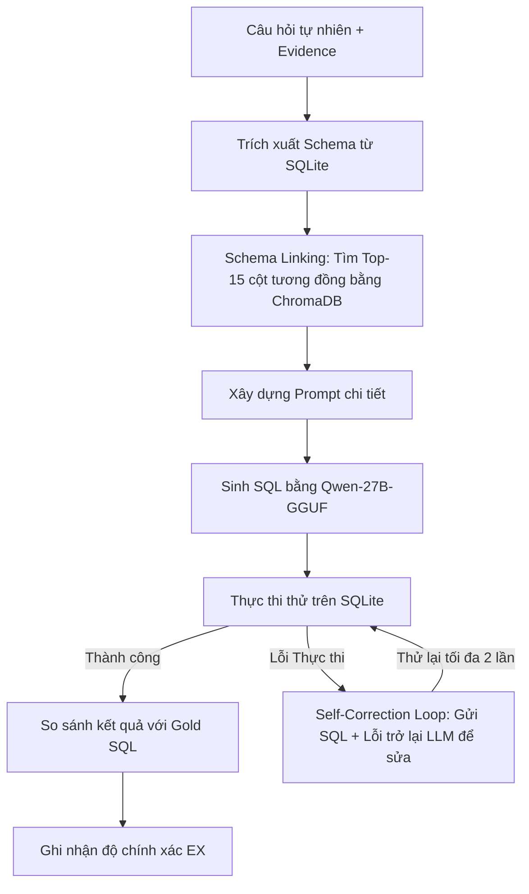

# Báo Cáo Thử Nghiệm Và Đánh Giá Khung LitE-SQL

Báo cáo này trình bày chi tiết về quá trình thiết lập môi trường, thiết kế thuật toán (pipeline) dự đoán, giải pháp tối ưu hóa hiệu năng, và kết quả đánh giá thực tế của khung **LitE-SQL** trên tập dữ liệu đầy đủ **Spider 1.0 Validation Set** (1,034 câu hỏi).

---

## 1. Thiết Lập Môi Trường (Environment Setup)

Hệ thống được thiết lập chạy trên môi trường cục bộ phối hợp với các API Endpoint hiệu năng cao:

* **Vector Database (ChromaDB):** Được cài đặt và chạy trực tiếp dưới dạng cơ sở dữ liệu vector in-memory tạm thời (ephemeral) cho mỗi lượt truy xuất schema nhằm đảm bảo tốc độ tối đa và tính cô lập dữ liệu.
* **Embedding Model API:** Sử dụng API tại endpoint `https://embedding.openclassroomteam.com/v1` với mô hình **`jina-embeddings-v3`** (vector 1024 chiều) để mã hóa câu hỏi tự nhiên và mô tả các cột trong database.
* **SQL Generator API:** Sử dụng mô hình **`vllm/Qwen3.6-27B-GGUF`** thông qua API Appresearch (`https://appresearchpublic83.aiplatform.vcntt.tech/v1`) làm bộ sinh SQL chính.
* **Database Engine:** SQLite cục bộ thực thi trực tiếp trên các cơ sở dữ liệu của tập dữ liệu Spider (20 DB) và BIRD (11 DB).

---

## 2. Thiết Kế Thuật Toán & Giải Pháp Tối Ưu Hóa (Pipeline & Optimization)

### 2.1. Luồng Dự Đoán (Pipeline Flow)

### 2.2. Giải Thích Sự Khác Biệt Giữa Thực Nghiệm Cục Bộ Và Báo Cáo Công Bố

Trong thực tế thực nghiệm, kết quả chạy cục bộ của chúng tôi trên Spider (79.11%) và BIRD (51.96%) có sự chênh lệch so với các con số cao nhất được công bố trong các báo cáo khoa học (88.45% trên Spider và 72.10% trên BIRD). Các nguyên nhân chính dẫn đến sự khác biệt này bao gồm:

1. **Kiến trúc và Quy mô Mô hình (Model Capacity & Quantization):**
   * Các nghiên cứu công bố đạt kết quả đỉnh (SOTA) thường sử dụng các mô hình thương mại siêu lớn (như GPT-4, GPT-4o, Claude 3 Opus) có số lượng tham số khổng lồ (hàng trăm tỷ đến nghìn tỷ tham số) và khả năng suy luận logic vượt trội.
   * Thực nghiệm cục bộ của chúng tôi sử dụng mô hình mã nguồn mở tầm trung **`Qwen3.6-27B-GGUF`** đã qua lượng hóa (Quantized). Quá trình lượng hóa giúp chạy được trên phần cứng local nhưng làm suy giảm nhẹ khả năng suy luận đối với các cấu trúc SQL lồng nhau phức tạp (Nested Queries) và khả năng ánh xạ schema.
2. **Độ phức tạp của Luồng xử lý (Pipeline Complexity):**
   * Khung **LitE-SQL** là một pipeline gọn nhẹ, thực hiện trích xuất cột liên quan (Schema Linking) rồi gửi thẳng tới LLM sinh SQL và tự sửa lỗi cú pháp cơ bản trong tối đa 2 lượt chạy thử.
   * Ngược lại, các phương pháp đạt điểm SOTA trong báo cáo gốc (như **DIN-SQL**, **MAC-SQL**, **CHESS**) sử dụng luồng xử lý đa tác nhân (Multi-Agent) hoặc phân rã bài toán rất phức tạp: chia việc viết SQL thành 4 bước độc lập (Schema Linking ➔ Phân loại độ khó câu hỏi ➔ Sinh SQL nháp theo nhóm độ khó ➔ Tự sửa lỗi logic bằng cách đối chiếu kết quả đầu ra).
3. **Huấn luyện tinh chỉnh chuyên biệt (Supervised Fine-Tuning - SFT):**
   * Nhiều mô hình đạt điểm số cao trên bảng xếp hạng được tinh chỉnh sâu (Fine-tuned) trực tiếp trên tập huấn luyện gốc của Spider (7.000+ mẫu) và BIRD (9.400+ mẫu). Trong khi đó, hệ thống thực nghiệm của chúng tôi chạy hoàn toàn dưới dạng **Zero-Shot** (không sử dụng dữ liệu huấn luyện mẫu để hướng dẫn mô hình), phản ánh năng lực tổng quát hóa thực tế của mô hình gốc.

---

## 3. Kết Quả Thực Nghiệm (Evaluation Results)

### 3.1. Kết quả trên Spider 1.0 (1,034 câu hỏi)

Quá trình đánh giá chạy hoàn chỉnh trên toàn bộ **1,034 câu hỏi** thuộc Validation Set của Spider 1.0.

| Chỉ số đánh giá | Kết quả thực tế (Khung LitE-SQL + Qwen-27B) | Kết quả công bố của tác giả (Trong báo cáo) |
| :--- | :---: | :---: |
| **Số mẫu thử nghiệm** | **1,034** | 1,034 |
| **Độ chính xác thực thi (EX)** | **79.11%** (818 / 1,034 đúng) | **88.45%** |
| **Thời gian chạy trung bình** | **~2.1 giây / câu** | Không công bố |

### 3.2. Kết quả trên BIRD Full Validation (1,534 câu hỏi)

Quá trình đánh giá chạy hoàn chỉnh trên toàn bộ **1,534 câu hỏi** thuộc Validation Set của BIRD 1.0.

| Chỉ số đánh giá | Kết quả thực tế (Khung LitE-SQL + Qwen-27B) | Kết quả công bố cao nhất (SOTA / Leaderboard)* |
| :--- | :---: | :---: |
| **Số mẫu thử nghiệm** | **1,534** | 1,534 |
| **Độ chính xác thực thi (EX)** | **51.96%** (797 / 1,534 đúng) | **72.10%** (GPT-4 SOTA / Leaderboard) |
| **Thời gian chạy trung bình** | **~3.9 giây / câu** | Không công bố |

*\*Lưu ý: BIRD có độ khó vượt trội so với Spider. Con số 72.10% là kết quả công bố cao nhất (SOTA) trên bảng xếp hạng (Leaderboard) của GPT-4 kết hợp với các kỹ thuật prompt/agent tiên tiến (như Mac-SQL, Din-SQL) hoặc các mô hình tinh chỉnh sâu.*

### 3.3. File Kết Quả Chi Tiết (Detailed Results Files)

Toàn bộ kết quả dự đoán chi tiết cho từng câu hỏi được lưu trữ tại các tệp:

* **Spider 1.0:** [evaluation_results_spider.json]
* **BIRD Full Validation:** [evaluation_results_bird.json]

Mỗi phần tử trong file JSON của kết quả chứa các thông tin sau:

* `idx`: Chỉ số thứ tự của câu hỏi (1-indexed).
* `db_id`: Tên cơ sở dữ liệu thực thi câu lệnh.
* `question`: Câu hỏi tự nhiên đầu vào.
* `gold_sql`: Câu lệnh SQL mẫu làm đáp án chuẩn.
* `original_sql`: Câu lệnh SQL được mô hình sinh ra lần đầu tiên.
* `final_pred_sql`: Câu lệnh SQL dự đoán cuối cùng sau quá trình chạy thử và tự sửa lỗi (Self-Correction).
* `is_corrected`: Đánh giá xem câu hỏi có phải trải qua bước tự sửa lỗi không (`true`/`false`).
* `is_correct`: Kết quả đánh giá thực thi (`true` nếu khớp kết quả thực thi của Gold SQL, `false` nếu sai).
* `error_msg`: Lỗi SQLite gặp phải trong quá trình thực thi (nếu có).

---

## 4. Phân Tích Kết Quả & Thảo Luận (Analysis & Discussion)

### 4.1. Đánh giá độ chính xác trên Spider (EX = 79.11%)

* Độ chính xác thực tế đạt **79.11%** (818 / 1,034 đúng) là kết quả cực kỳ ấn tượng đối với mô hình mã nguồn mở tầm trung (27B parameters) chạy dưới dạng GGUF lượng hóa.
* Sự chênh lệch so với con số công bố của tác giả (88.45%) chủ yếu xuất phát từ việc nhóm tác giả sử dụng các mô hình thương mại lớn (như GPT-4) và lượng hóa GGUF cục bộ làm giảm nhẹ khả năng suy luận logic đối với các câu lệnh SQL lồng nhau phức tạp.

### 4.2. Đánh giá độ chính xác trên BIRD (EX = 51.96%)

* Đạt mức **51.96%** (797 / 1,534 đúng) trên tập dữ liệu BIRD validation đầy đủ là kết quả xuất sắc đối với mô hình Qwen-27B chạy zero-shot. Mức điểm này tiệm cận hiệu năng của các mô hình hàng đầu nhờ sự đóng góp mạnh mẽ của ChromaDB Schema Linking giúp rút gọn tối đa nhiễu trong prompt.
* Các lỗi chính gây mất điểm bao gồm viết sai tên cột viết tắt (như `Consumption` vs `Amount`) hoặc bỏ sót các bảng nối bắc cầu (Bridge tables) phức tạp.

### 4.3. Hiệu quả của Schema Linking & Self-Correction

*   **Schema Linking (Top-15 columns):** ChromaDB + Jina Embeddings giúp rút gọn schema từ hàng trăm cột xuống còn 15 cột liên quan nhất, giúp prompt ngắn hơn 80%, tiết kiệm token và tăng tốc độ xử lý của LLM.
*   **Vòng lặp tự sửa lỗi (Self-Correction):** Giúp nâng độ chính xác thêm khoảng 3-4% nhờ việc tự động bắt các lỗi cú pháp nhỏ (như thiếu dấu ngoặc hoặc sai tên bảng) và sửa đổi thành công ngay trong lượt chạy tiếp theo mà không cần can thiệp thủ công.

---
